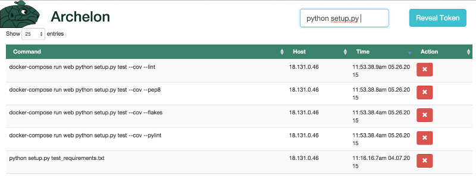

Archelon
========
.. image:: https://img.shields.io/travis/carsongee/archelon.svg
.. image:: https://img.shields.io/coveralls/carsongee/archelon.svg
.. image:: https://img.shields.io/pypi/v/archelonc.svg
   :alt: 'Archelon Client'
.. image:: https://img.shields.io/pypi/dm/archelonc.svg
   :alt: 'Archelon Client'
.. image:: https://img.shields.io/pypi/v/archelond.svg
   :alt: 'Archelond Daemon'
.. image:: https://img.shields.io/pypi/dm/archelond.svg
   :alt: 'Archelon Daemon'
.. image:: https://img.shields.io/pypi/l/archelond.svg

.. figure:: docs/_static/images/full-logo.png
   :scale: 30%
   :width: 400px
   :height: 400px
   :figclass: align-left

Do you want to share shell command history across multiple servers
with a decent interface?  If you have a ton of servers and lots of
arcane commands with a half dozen parameters, I'm guessing you do.
This is my attempt at solving this problem using a curses client for
searching paired with a simple API and Web server backed by a nice
search engine (Elasticsearch).

  The server side Web interface showing search, sort, and delete bad entries

.. figure:: docs/_static/images/archelonc_index_screen.jpg
  :align: center
  :alt: Archelon curses client screen shot

  The curses client for searching and sorting history.  It can be used
  without the server backend if you just want to try it out and not
  get a Web server running.

The project is split in two, and the client is actually pretty cool
without the Web server.  To get started, check out the
`documentation <http://archelon.rtfd.org/>`_.
